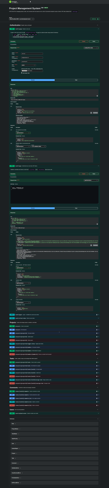

# Project Management System API

---

## Folder Structure

```text
src/
├── auth/
├── users/
├── projects/
├── tasks/
├── comments/
├── uploads/
├── common/
│   ├── guards/
│   ├── decorators/
│   ├── filters/
│   ├── interceptors/
│   └── pipes/
├── config/
├── database/
└── main.ts
```

---

## Setup Steps

### 1. Clone Repository

```bash
git clone https://github.com/majidali129/project-management-system-api.git
cd project-management-system-api
```

### 2. Install Dependencies

```bash
pnpm install
```

### 3. Configure Environment Variables

Copy `.env.example` to `.env` and fill in your values.

| Variable | Description |
| --- | --- |
| `PORT` | Server port (default `3000`) |
| `DB_URI` | MongoDB connection string |
| `ACCESS_TOKEN_SECRET` | JWT access token secret |
| `ACCESS_TOKEN_EXPIRY` | Access token expiry (e.g. `2d`) |
| `REFRESH_TOKEN_SECRET` | JWT refresh token secret |
| `REFRESH_TOKEN_EXPIRY` | Refresh token expiry (e.g. `7d`) |
| `DEFAULT_LIMIT` | Default pagination limit |
| `DEFAULT_PAGE` | Default pagination page |
| `CLOUDINARY_CLOUD_NAME` | Cloudinary cloud name |
| `CLOUDINARY_API_KEY` | Cloudinary API key |
| `CLOUDINARY_API_SECRET` | Cloudinary API secret |

### 4. Run Application

```bash
pnpm run start:dev
```

---

## API Base URL

```text
http://localhost:3000
```

---

## Swagger Documentation

Swagger UI (server must be running):

```text
http://localhost:3000/api
```



---

## API Documentation

OpenAPI specification: [docs/api/openapi.yaml](docs/api/openapi.yaml)

---

## Database Schema

Schema explanation: [docs/database-schema.md](docs/database-schema.md)

---

## Authentication Instructions

### Register

```http
POST /auth/signup
```

```json
{
  "name": "John Doe",
  "email": "john@example.com",
  "password": "secret1234",
  "role": "user"
}
```

### Login

```http
POST /auth/login
```

```json
{
  "email": "john@example.com",
  "password": "secret1234"
}
```

Response includes `accessToken` and `refreshToken`. Use the access token on protected routes:

```http
Authorization: Bearer <access-token>
```

Example:

```http
GET /projects
Authorization: Bearer eyJhbGciOi...
```

---

## Sample Requests

### Create Project

```http
POST /projects
Authorization: Bearer <token>
```

```json
{
  "title": "Implement User Authentication",
  "description": "Allow project owners to invite members and manage access."
}
```

### Get All Projects

```http
GET /projects?page=1&limit=5&search=nestjs
Authorization: Bearer <token>
```

### Create Task

```http
POST /projects/{projectId}/tasks
Authorization: Bearer <token>
```

```json
{
  "title": "Add Activity Logging",
  "description": "Track user actions",
  "priority": "high",
  "dueDate": "2026-04-05T00:00:00.000Z"
}
```

### Get Tasks With Filtering

```http
GET /projects/{projectId}/tasks?page=1&limit=10&status=done&sortBy=dueDate&sortOrder=desc
Authorization: Bearer <token>
```

### Create Comment

```http
POST /tasks/{taskId}/comments
Authorization: Bearer <token>
```

```json
{
  "content": "Looks good, merging now."
}
```
ter