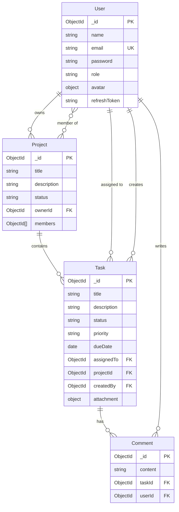

# Database Schema

MongoDB database used by the Project Management System API. Collections are defined with Mongoose schemas under `src/*/schemas/`. All main entities use `timestamps: true` (`createdAt`, `updatedAt`).

## Entity Relationship Diagram

## Collections

### `users`

| Field | Type | Required | Notes |
| --- | --- | --- | --- |
| `name` | `string` | Yes | Min 3 characters |
| `email` | `string` | Yes | Unique |
| `password` | `string` | Yes | Min 8 characters; stored hashed |
| `role` | `string` | Yes | `admin` \| `user` |
| `avatar` | `{ url, publicId }` | No | Cloudinary file reference |
| `refreshToken` | `string` | No | Used for token refresh |
| `createdAt` | `Date` | Auto | Mongoose timestamp |
| `updatedAt` | `Date` | Auto | Mongoose timestamp |

### `projects`

| Field | Type | Required | Notes |
| --- | --- | --- | --- |
| `title` | `string` | Yes | 3–50 characters |
| `description` | `string` | Yes | Max 200 characters |
| `status` | `string` | Yes | `active` \| `completed` \| `archived` (default: `active`) |
| `ownerId` | `ObjectId` | Yes | Ref → `User` |
| `members` | `ObjectId[]` | No | Ref → `User`; default `[]` |
| `createdAt` | `Date` | Auto | Mongoose timestamp |
| `updatedAt` | `Date` | Auto | Mongoose timestamp |

### `tasks`

| Field | Type | Required | Notes |
| --- | --- | --- | --- |
| `title` | `string` | Yes | Min 5 characters |
| `description` | `string` | Yes | Max 300 characters |
| `status` | `string` | Yes | `todo` \| `in_progress` \| `done` (default: `todo`) |
| `priority` | `string` | Yes | `low` \| `medium` \| `high` (default: `medium`) |
| `dueDate` | `Date` | Yes | Task deadline |
| `assignedTo` | `ObjectId` | No | Ref → `User` |
| `projectId` | `ObjectId` | Yes | Ref → `Project` |
| `createdBy` | `ObjectId` | Yes | Ref → `User` |
| `attachment` | `{ url, publicId }` | No | Cloudinary file reference |
| `createdAt` | `Date` | Auto | Mongoose timestamp |
| `updatedAt` | `Date` | Auto | Mongoose timestamp |

### `comments`

| Field | Type | Required | Notes |
| --- | --- | --- | --- |
| `content` | `string` | Yes | Comment body |
| `taskId` | `ObjectId` | Yes | Ref → `Task` |
| `userId` | `ObjectId` | Yes | Ref → `User` (author) |
| `createdAt` | `Date` | Auto | Mongoose timestamp |
| `updatedAt` | `Date` | Auto | Mongoose timestamp |

## Relationships

| From | Field | To | Cardinality | Description |
| --- | --- | --- | --- | --- |
| Project | `ownerId` | User | N:1 | Each project has one owner |
| Project | `members` | User | N:M | Users invited to a project |
| Task | `projectId` | Project | N:1 | Tasks belong to one project |
| Task | `assignedTo` | User | N:1 | Optional assignee |
| Task | `createdBy` | User | N:1 | User who created the task |
| Comment | `taskId` | Task | N:1 | Comments belong to one task |
| Comment | `userId` | User | N:1 | Author of the comment |

## Access patterns

- **Projects** are scoped by ownership and membership: users see projects they own or are listed in `members`; admins can access all projects.
- **Tasks** are scoped by `projectId`; only project members can create tasks within a project.
- **Comments** are scoped by `taskId`; users can delete their own comments (`userId` match).

## Indexes

- `users.email` — unique index (enforced by Mongoose `unique: true`)
